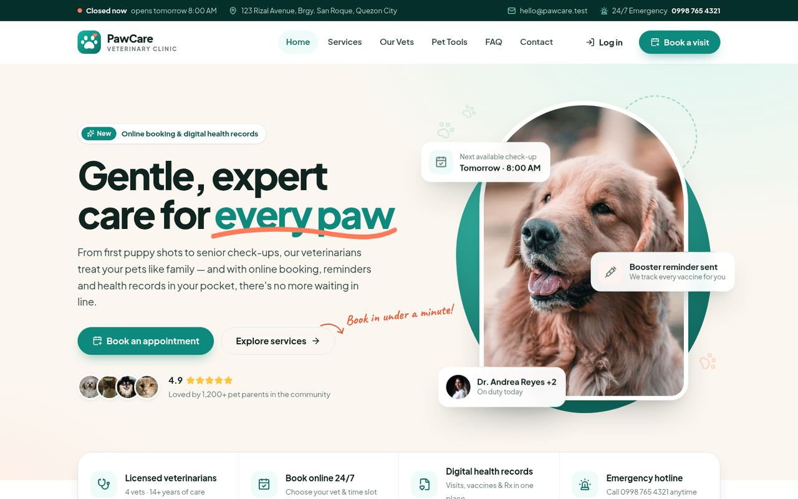
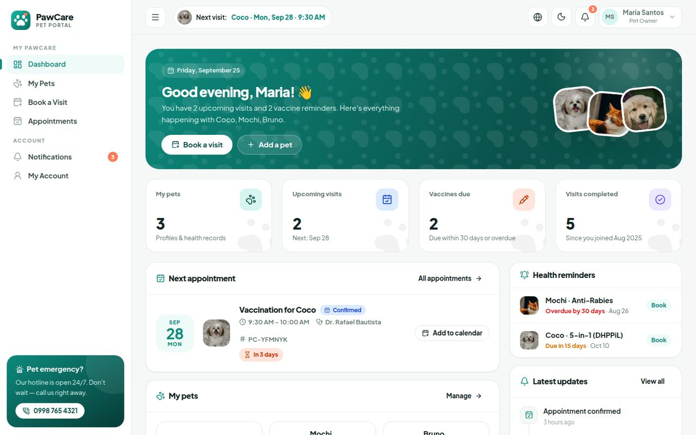
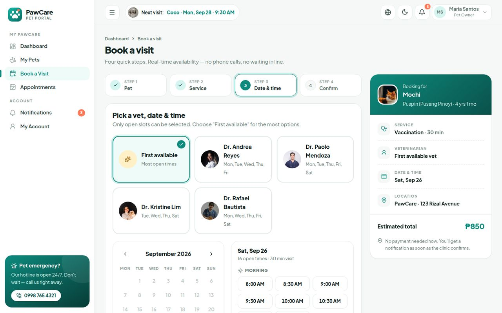
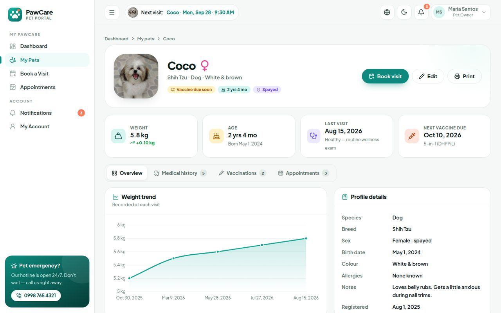
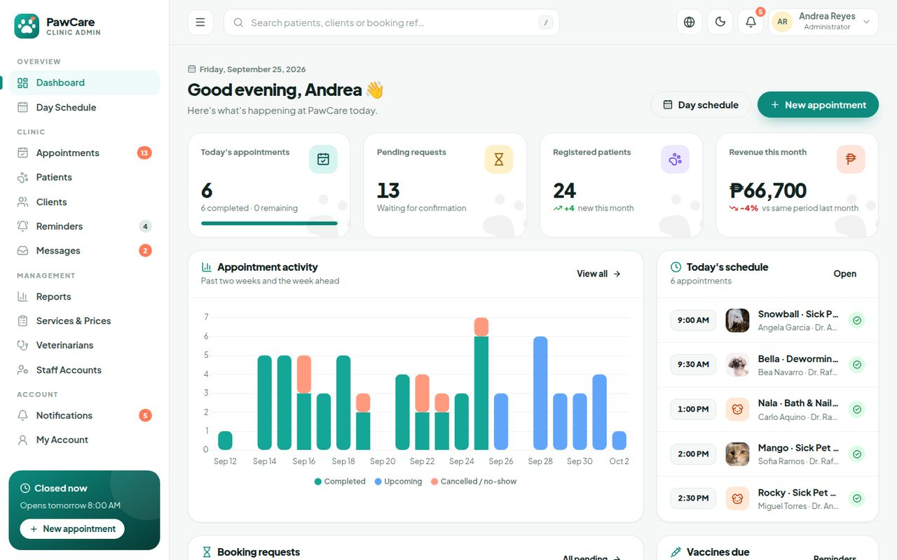
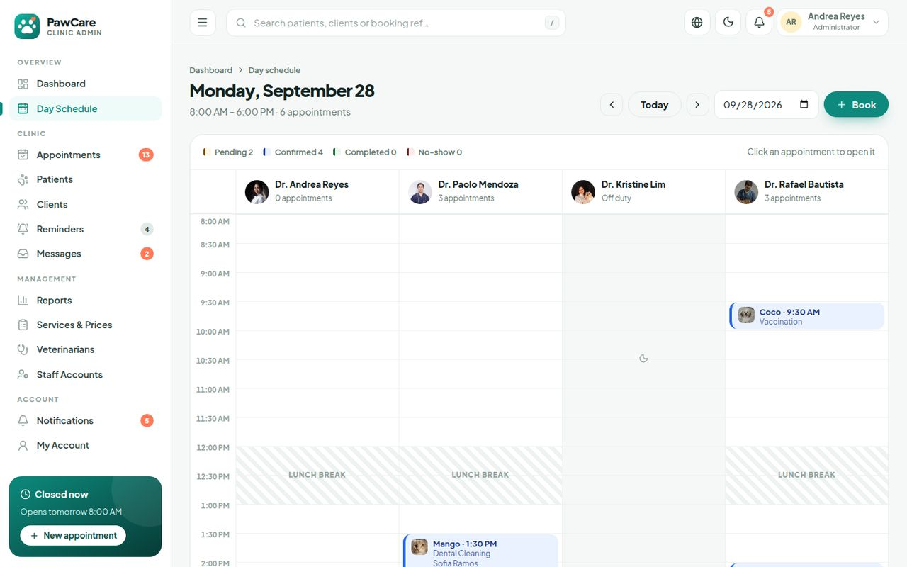
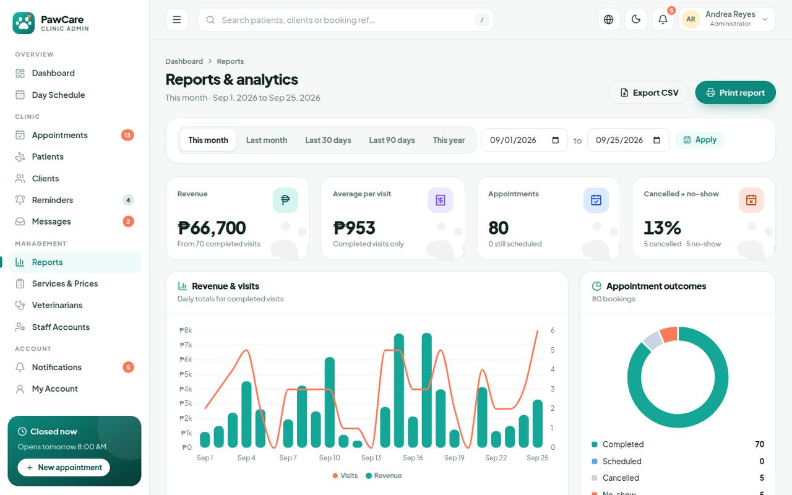

# 🐾 PawCare — Veterinary Clinic Website & Management System

A complete web system for a small veterinary clinic, built with **PHP, MySQL and Apache** (runs on XAMPP).
Pet owners book visits online and follow their pets' health records. Clinic staff manage the schedule, patients, medical records, vaccine reminders and reports from one dashboard.



---

## Features

### 🌐 Public website
- Animated hero, service catalogue with category filters, "why us" section, vet team, testimonials carousel and FAQ accordion
- **Pet tools:** pet age calculator (dog size / cat) and an interactive vaccine schedule guide
- Live "Open now / Closed" status and the next available appointment, both taken from the real schedule
- Contact form stored in the admin inbox, with spam protection (honeypot field and a 30-second cooldown)
- Full price list page with search

### 🐶 Pet-owner portal
- Register and log in (password strength meter, one-click demo accounts)
- Dashboard with upcoming visits, vaccine reminders, pet cards and recent visit notes
- Pet profiles with photo upload, weight-trend chart, medical history timeline, vaccine card and a printable health record
- **4-step booking wizard:** pet → service → vet, date and time (live calendar and open time slots) → confirm
- Manage appointments (upcoming / past / cancelled), cancel online and export to Google or Outlook calendar (`.ics`)
- In-app notifications (booking confirmed, rescheduled, vaccine due and more)

### 🩺 Clinic staff & admin panel
- Dashboard with KPIs, appointment-activity chart, today's schedule, booking requests (one-click confirm or decline) and vaccines due
- **Day schedule:** time grid per veterinarian, with lunch break and off-duty days
- Appointments: filter, search, walk-in booking, confirm / complete / no-show / cancel, reschedule with live slots
- **Record a visit:** vitals, diagnosis, treatment, prescription, follow-up date and vaccine given (updates the pet's record automatically)
- Patients and clients (CRUD, temporary passwords for walk-in clients), global search (`/` shortcut)
- **CSV export** of appointments, patients and clients
- Vaccine and appointment reminders sent as notifications in one click
- **Reports** (admin): revenue, visits, outcomes, services, vet performance, species, with date presets, CSV export and a print layout
- Manage services and prices, veterinarians (working days and photo), staff accounts, and the contact-message inbox
- Roles: **Admin** (everything), **Staff** (front desk and clinical work), **Owner** (own pets only)

### ✨ Design
Responsive layouts from phone to desktop, **dark mode** in the portals, smooth animations, toast messages, native modal dialogs, confetti after booking, print styles, and 160+ inline SVG icons.

---

## Quick start (XAMPP)

1. Install [XAMPP](https://www.apachefriends.org/) with **PHP 8.0 or newer**.
2. Copy this project folder into `C:\xampp\htdocs\` and name it, for example, `pawcare`.
3. Open the XAMPP Control Panel and start **Apache** and **MySQL**.
4. Visit **http://localhost/pawcare/setup.php** and click **Install**.
   This creates the `pawcare` database, all tables and realistic demo data.
5. Open **http://localhost/pawcare/** 🎉

> Any folder name works because URLs are detected automatically.
> The database uses XAMPP's default login (`root`, no password). To change it, edit `includes/config.php`.

### Demo accounts

| Role | Email | Password |
|------|-------|----------|
| Admin | `admin@pawcare.test` | `admin123` |
| Staff (front desk) | `staff@pawcare.test` | `staff123` |
| Pet owner | `owner@pawcare.test` | `owner123` |

The login page also has one-click demo buttons. To hide them, set `SHOW_DEMO_LOGINS` to `false`.
To start over with fresh demo data, open `setup.php` again and use **Reset** (allowed from the same computer or by an admin).
Demo dates are generated relative to the install date, so the schedule always looks current.

---

## Customising for your client

| What | Where |
|------|-------|
| Clinic name, phone, address, email, social links | `includes/config.php` |
| Opening hours, lunch break, slot length, booking window and cancellation rules | `includes/config.php` |
| Services and prices, veterinarians and staff | Admin panel, no code needed |
| Website photos (hero, about, banners, login pages) | `assets/img/` (keep the same file names) |
| Demo pet and vet photos | `assets/img/pets/`, `assets/img/vets/` |
| Colours and fonts | CSS variables at the top of `assets/css/base.css` |

Photos uploaded through the system (pets, vets) are saved in `uploads/`.

---

## Project structure

```
├── index.php, services.php          Public website
├── login.php, register.php          Authentication
├── owner/                           Pet-owner portal (dashboard, pets, booking, appointments)
├── admin/                           Staff & admin panel (schedule, patients, clients, reports…)
├── api/                             JSON endpoints (time slots, search, notifications, pets)
├── includes/                        Config, database helpers, auth, scheduling, layouts, icons
├── database/schema.sql              Database structure (10 tables)
├── database/demo_data.php           Demo data generator
├── setup.php                        One-click installer
├── assets/                          CSS, JavaScript, fonts, images, Chart.js
└── uploads/                         User-uploaded photos
```

**Database tables:** `users`, `vets`, `services`, `pets`, `appointments`, `medical_records`, `vaccinations`, `notifications`, `contact_messages`, `activity_log`.

---

## Security
- Passwords hashed with `password_hash()` (bcrypt); login locks for a short time after 5 failed attempts
- PDO prepared statements everywhere (no SQL injection)
- CSRF token on every form; all output escaped (XSS protection)
- Role-based access checks on every page and API; owners can only see their own pets
- Session cookies are HttpOnly and SameSite, and the session ID is regenerated on login
- Uploads are checked as real images (not just by file extension), renamed randomly, and PHP is blocked from running in `uploads/`
- `.htaccess` blocks direct access to `includes/` and `database/`
- Double-booking is prevented with a transaction and row locks when a slot is booked or moved

> Before putting the site online, set `APP_DEBUG` to `false` and `SHOW_DEMO_LOGINS` to `false`, and delete `setup.php`.

---

## Tech stack & credits
- PHP 8 · MySQL / MariaDB · Apache · HTML5 · CSS3 · vanilla JavaScript (no frameworks)
- [Chart.js](https://www.chartjs.org/) 4.5 (MIT), bundled locally
- Icons from [Lucide](https://lucide.dev/) (ISC), inlined as SVG
- Fonts: [Plus Jakarta Sans](https://fonts.google.com/specimen/Plus+Jakarta+Sans) and [Caveat](https://fonts.google.com/specimen/Caveat) (SIL Open Font License), self-hosted
- Photos from [Pexels](https://www.pexels.com/) (free under the Pexels License). They are placeholders; replace them with the client's own photos.
- The map uses a Google Maps embed (needs an internet connection)

---

## Screenshots

| Pet-owner dashboard | Booking wizard |
|---|---|
|  |  |
| **Pet health record** | **Admin dashboard** |
|  |  |
| **Day schedule** | **Reports & analytics** |
|  |  |
